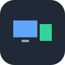
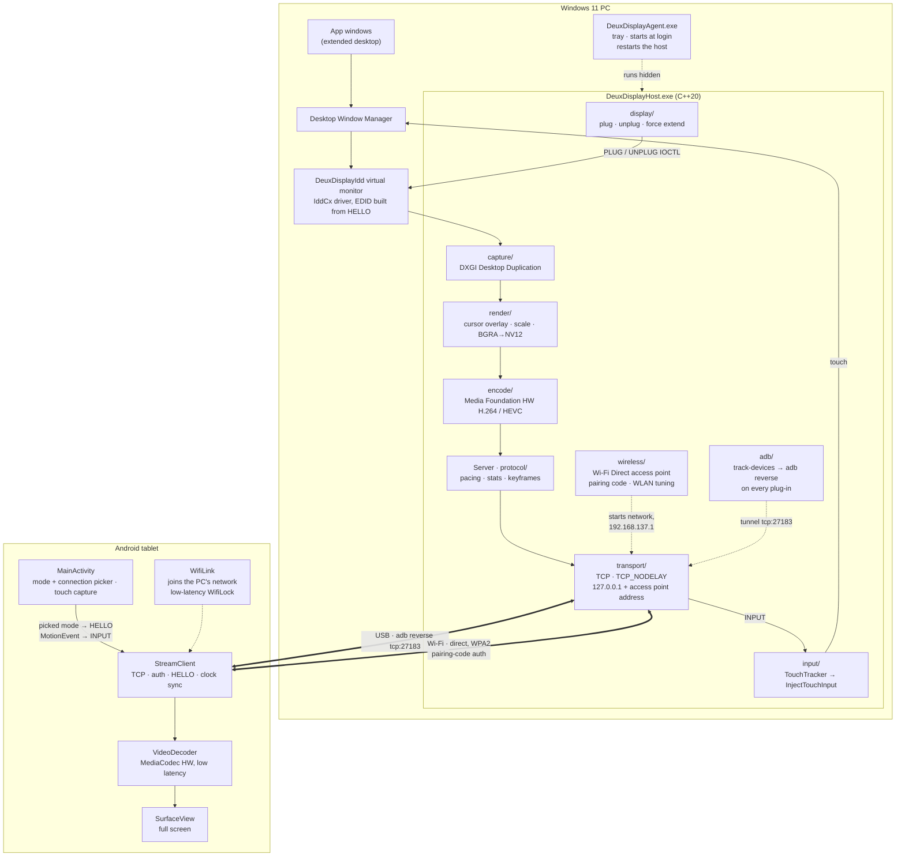
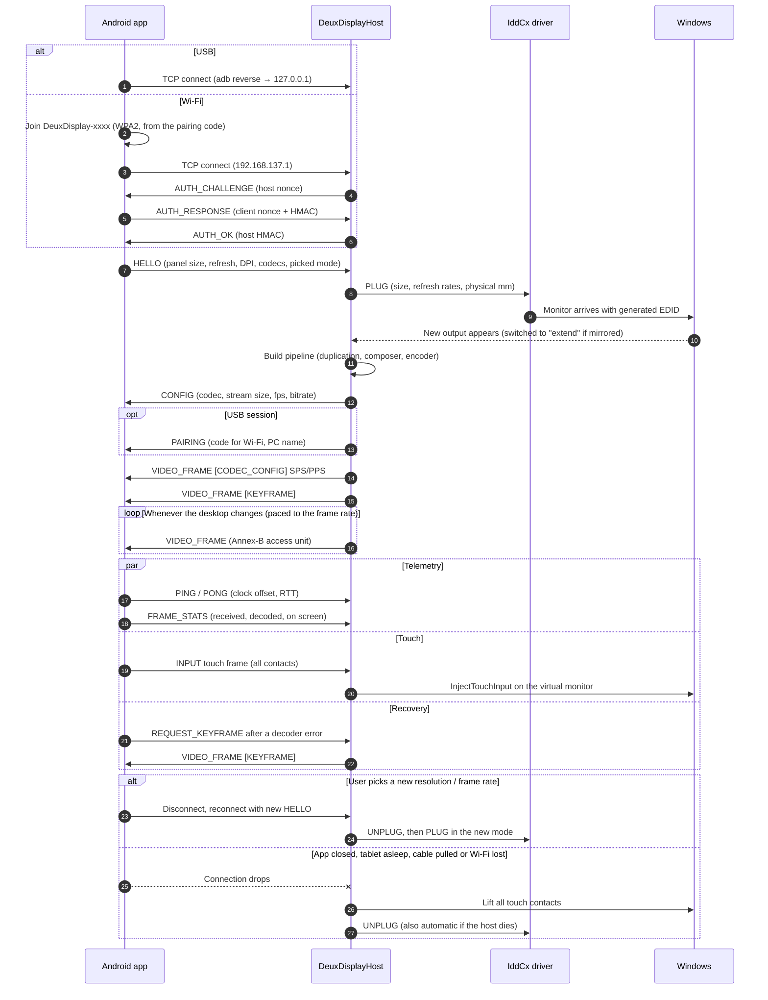
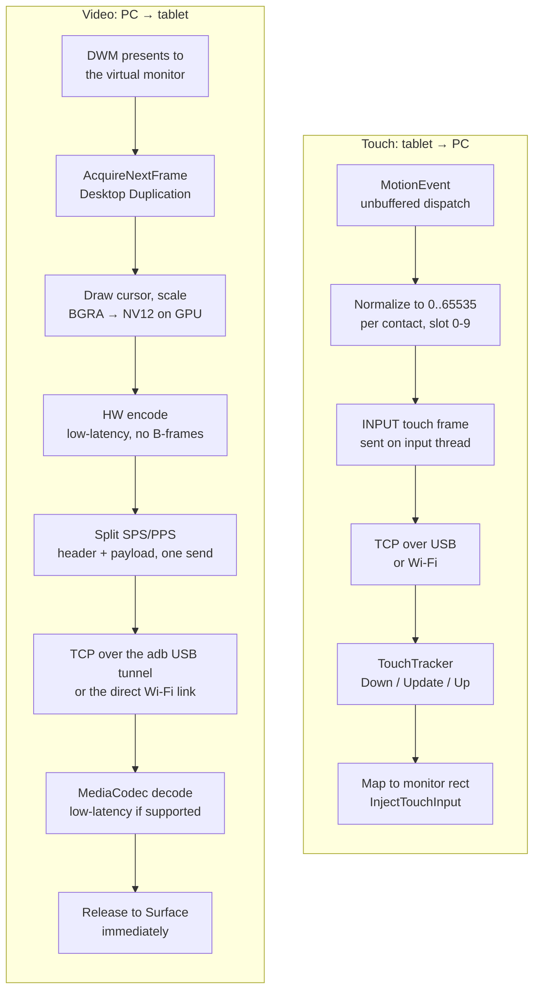
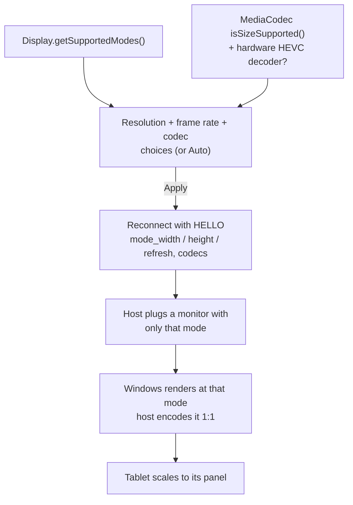
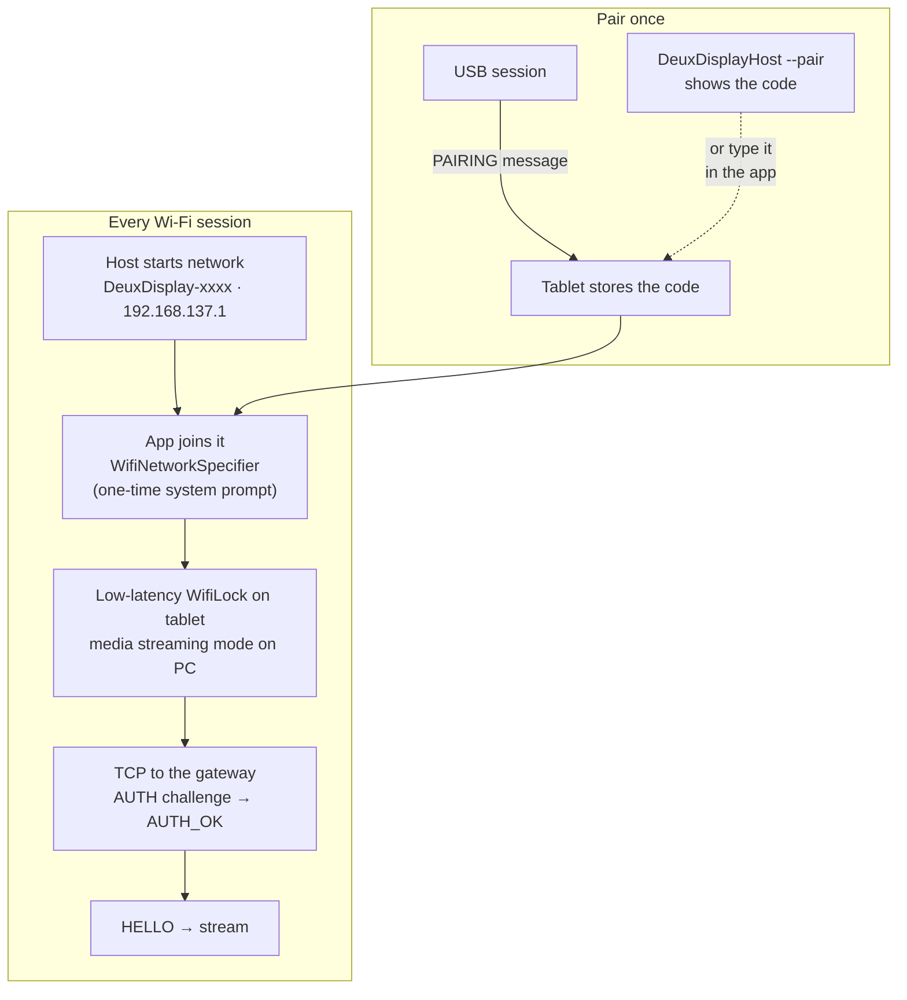

<p align="center"></p>

# DeuxDisplay

Use an Android tablet as a **low-latency extended monitor** for Windows 11, over a USB-C cable
or wirelessly over a direct Wi-Fi link to the PC.

DeuxDisplay adds a real virtual monitor to Windows through an Indirect Display Driver. It captures
that monitor with Desktop Duplication, hardware-encodes it to H.264/HEVC in low-latency mode, and
streams it to an Android app that decodes straight to the screen. The stream travels over an ADB
USB tunnel, or over a private Wi-Fi network the PC creates itself (no router in between).

> **Status: early development, working end to end on the reference device.** Prebuilt
> downloads are on the [Releases](https://github.com/zengarv/DeuxDisplay/releases) page.

Reference hardware: OnePlus Pad Go (2408×1720 @ 90 Hz). Other Windows 11 PCs and Android 8+
devices are meant to work too.

## How it works

A virtual monitor on the PC is captured, hardware-encoded and streamed to the tablet, which
decodes it straight to the screen. Touches on the tablet travel the same connection back and are
injected on that monitor. The host serves **USB** and **Wi-Fi** at the same time, and the app
picks which one to use.

---

### Architecture



| Part | Where | Job |
|------|-------|-----|
| Virtual display driver | `driver/` | Adds a real monitor to Windows, sized to the tablet (MS-PL) |
| Host | `host/` | Plugs the monitor, captures, encodes, streams, injects touch, keeps the USB tunnel up |
| Agent | `host/agent/` | Tray app that runs the host in the background from login |
| Android client | `android/` | Connects, decodes to the screen, sends touch and the picked mode |
| Wire protocol | `docs/wire-protocol.md` | Source of truth for every message both sides exchange |
| Wi-Fi link | `host/src/wireless/`, `android/.../WifiLink.kt` | The PC's own network, pairing, radio tuning |

---

### A session, end to end



---

### Frame and touch paths

Every stage below is on the latency budget: no queues, no frame pacing on the client, one
`send()` per message. Numbers live in [docs/latency-notes.md](docs/latency-notes.md).



---

### Picking the stream format

The app lists only modes the device can show: the panel's own sizes and refresh rates, plus
scaled-down sizes the hardware decoder accepts, and a 30 fps stream-only rate. Press **Back**
while streaming to open the picker. Choices made there override the host's `--max-stream-size`,
`--max-fps` and `--codec` options.

**Codec** is *Auto*, *H.264* or *HEVC (H.265)* (HEVC is listed only if the tablet has a hardware
HEVC decoder). The pick travels in HELLO's `codecs` bitmask: the app advertises only the chosen
codec. *Auto* offers HEVC only at sizes the HEVC decoder is rated for, and the host then prefers
it; an explicit HEVC pick is used at any size. HEVC gives sharper text per bit and more decoder
headroom, but on the reference tablet it doesn't lower latency (see
[docs/latency-notes.md](docs/latency-notes.md)).



---

### Connecting over Wi-Fi

The PC runs its own Wi-Fi network (a Wi-Fi Direct group in "legacy" mode, which the tablet joins
like any WPA2 access point). Each frame crosses the air once, with no router and no other traffic
on the link. One **pairing code** (20 characters) derives the network name, its WPA2 passphrase
and the key for a mutual challenge-response, so only paired tablets can join or connect.



- The host listens only on 127.0.0.1 (USB) and on its own network's address, never on your LAN.
- While streaming over Wi-Fi the tablet leaves its usual Wi-Fi (most tablets can't join two
  networks), so it has no internet until the app closes.
- **Latency status:** the direct link is ~2x faster at the median and 3–7x higher in throughput
  than going through a router. But the Windows/Intel AX211 access point is away for ~60 ms of
  every ~100 ms beacon period, so frames currently land 55–60 ms after capture (vs ~23 ms over USB).
  Details and next steps are in [docs/latency-notes.md](docs/latency-notes.md#wi-fi). USB is
  still the lowest-latency option.

More detail in [docs/architecture.md](docs/architecture.md) and the protocol spec in
[docs/wire-protocol.md](docs/wire-protocol.md).

## Repository layout

| Path                 | What                                                            |
|----------------------|-----------------------------------------------------------------|
| `driver/`            | IddCx virtual display driver (C++, UMDF)                        |
| `host/`              | Windows capture/encode/stream service (C++20)                   |
| `android/`           | Android client app (Kotlin)                                     |
| `docs/`              | Architecture, wire protocol, latency notes                      |
| `scripts/`           | Dev bootstrap, driver install, Wi-Fi firewall rule, run helpers |
| `.github/workflows/` | CI                                                              |

## Getting started

The whole flow, once: **get the code → set up → build → install → run over USB and/or Wi-Fi.**
Everything after step 4 runs without admin rights.

| Mode  | Needs                                                   | Typical latency\* | How it starts                  |
|-------|---------------------------------------------------------|-------------------|--------------------------------|
| USB   | USB cable, USB debugging on                             | ~23 ms to tablet  | Plug in (background agent) or `run.ps1` |
| Wi-Fi | Paired once over USB, Android 10+, PC Wi-Fi with Wi-Fi Direct | ~55–60 ms to tablet | `run.ps1 -Transport Both`, then pick Wi-Fi in the app |

\* Capture to "received on the tablet", p50, reference hardware. Decoding and display add more;
see [docs/latency-notes.md](docs/latency-notes.md).

### 1. Get DeuxDisplay

**Option A: prebuilt release (no build tools needed).** From
[Releases](https://github.com/zengarv/DeuxDisplay/releases), download:

- `DeuxDisplay-<version>-win-x64.zip` for the PC: the host, the tray agent, the driver package
  and the scripts, in the same layout as a source checkout, so every command below works from
  the extracted folder.
- `DeuxDisplay-<version>.apk` for the tablet (installing it is covered in step 4).

Extract the zip, then:

```powershell
cd DeuxDisplay-<version>
Get-ChildItem -Recurse | Unblock-File            # Windows marks downloaded files as untrusted
Set-ExecutionPolicy -Scope Process Bypass        # allow the scripts; repeat in each new shell
winget install Google.PlatformTools              # adb, needed for USB (open a new shell after)
```

Skip the PC setup in step 2 and all of step 3. The driver is signed on your PC during install
(step 4), as with a source build.

**Option B: build from source.** Clone the repository:

```powershell
git clone https://github.com/zengarv/DeuxDisplay.git
cd DeuxDisplay
```

Every push is also built by CI. The **Actions** tab has artifacts from the latest run (the app's
`app-debug` APK, `DeuxDisplayHost`, and an unsigned driver package).

### 2. One-time setup

**PC** (Windows 11 x64; source builds only):
- Visual Studio 2022 or **Build Tools 2022** (17.14+) with **Desktop development with C++**
  (MSVC v143, Windows 11 SDK), plus the **Windows Driver Kit** component
  (`Component.Microsoft.Windows.DriverKit.BuildTools` for Build Tools). The WDK itself comes from
  NuGet during the build.
- The Java/Android toolchain (JDK 17, Android SDK, adb), installed per user with one script:
  ```powershell
  .\scripts\bootstrap-dev.ps1        # add -PersistEnv to set JAVA_HOME/ANDROID_HOME/PATH for new shells
  ```

**Tablet** (Android 8+; Wi-Fi mode needs Android 10+):
1. Settings > About tablet > tap **Build number** 7 times to unlock Developer options.
2. Developer options > turn on **USB debugging**.
3. Plug it into the PC and accept **Allow USB debugging** (tick *Always allow from this computer*).

### 3. Build

From a *Developer PowerShell for VS 2022*. Use the 64-bit MSBuild; the dev shell's default is fine.

```powershell
# Host (DeuxDisplayHost.exe, the tray agent, and tests)
msbuild DeuxDisplay.sln /p:Configuration=Release /p:Platform=x64 /m
.\host\x64\Release\DeuxDisplayHostTests.exe

# Driver (restores the WDK from NuGet first)
msbuild driver\DeuxDisplayIdd.sln /t:restore /p:RestorePackagesConfig=true
msbuild driver\DeuxDisplayIdd.sln /p:Configuration=Release /p:Platform=x64

# Android app
cd android; .\gradlew.bat assembleDebug; cd ..
```

### 4. Install

```powershell
# Elevated PowerShell, once: signs and installs the driver, creates the virtual display device,
# and adds the firewall rule Wi-Fi needs. No test-signing mode required.
.\scripts\install-driver.ps1

# Normal PowerShell: install the app on the tablet (plugged in over USB)
.\scripts\run.ps1 -Install          # installs, launches, and starts streaming over USB; Ctrl+C stops
```

With a release, either put `DeuxDisplay-<version>.apk` in the extracted folder so
`run.ps1 -Install` finds it, or install it on the tablet directly: open the Releases page in the
tablet's browser, download the APK and open it (allow installing unknown apps when asked).
Newer releases install over older ones.

`install-driver.ps1` trusts a locally generated signing certificate on your PC; read
[driver/README.md](driver/README.md) first. To check the driver alone:
`.\host\x64\Release\DeuxDisplayHost.exe --create-display` makes a monitor appear.

### 5. Run over USB

**Plug and play (recommended).** Set this up once:
```powershell
.\scripts\install-autostart.ps1    # per user, no admin; -Remove undoes it
```
It starts **DeuxDisplayAgent** now and at every login: a tray icon that keeps the host running
in the background (log: `%LOCALAPPDATA%\DeuxDisplay\host.log`). From then on it behaves like a
monitor cable:

1. Open DeuxDisplay on the tablet.
2. Plug in the USB cable. The tablet appears as a monitor next to your main display within about
   a second.
3. Unplug it, close the app or let the tablet sleep, and the monitor goes away.

Plugging in with the app closed does nothing: the tablet just charges.

**App stuck on "waiting for DeuxDisplay on your PC"?** The agent isn't running (no DeuxDisplay
tray icon), for example after choosing **Exit** in its menu. Start it again by running
`host\x64\Release\DeuxDisplayAgent.exe` (double-click it, or re-run `install-autostart.ps1`), or
by signing out and back in.

**From a console** (to try options or watch the log live): exit the agent from the tray first,
then:
```powershell
.\scripts\run.ps1 -Transport Usb    # Ctrl+C to stop
```

- **Any USB mode works:** *Charging only* (Android's default), *File transfer* and so on. adb runs
  alongside all of them. Switching modes briefly drops the display, and it comes back by itself.
- The host re-creates the adb tunnel whenever the tablet (re)appears: cable re-plugged, USB mode
  switched, or the adb server restarted by another tool. No need to run `adb reverse` yourself.
- Only one adb version should run on the PC. Tools that bundle their own `adb.exe` (some
  phone-mirroring apps) keep restarting the adb server and drop the tunnel.

### 6. Run over Wi-Fi

The PC runs its own small Wi-Fi network (`DeuxDisplay-xxxx`), and the tablet joins it directly;
no router is involved. The background agent serves **USB only**, so Wi-Fi runs from a console.

1. **Pair once over USB.** Connect over USB with the app open (step 5). The USB session hands the
   tablet the pairing code automatically; the app's settings then show *Wi-Fi: paired with
   &lt;your PC&gt;*. Without a cable: run `.\host\x64\Release\DeuxDisplayHost.exe --pair` to show the
   code and type it into the app's pairing field.
2. **Exit the agent** from the tray icon, if it's running.
3. **Start the host with Wi-Fi:**
   ```powershell
   .\scripts\run.ps1 -Transport Both   # USB and Wi-Fi together; or -Transport Wifi
   ```
   The log shows `wifi: network "DeuxDisplay-xxxx" is up` and
   `waiting for a client on USB (...) or Wi-Fi (192.168.137.1:27183)`.
4. **On the tablet:** press **Back**, set **Connection** to *Wi-Fi (direct to PC)* and tap
   **Apply**. The first time, Android asks to connect to `DeuxDisplay-xxxx`; tap **Connect**.
   The log shows `session: client "..." over Wi-Fi`.
5. **Unplug the cable** if you like; the display stays.

Good to know:
- While streaming over Wi-Fi, the tablet leaves its usual Wi-Fi network (most tablets can't join
  two), so it has no internet until you close the app or switch back to USB.
- Windows Firewall must allow the host inbound. `install-driver.ps1` adds the rule
  (`scripts\enable-wireless.ps1`); otherwise Windows asks the first time. Allow it.
- The PC needs a Wi-Fi adapter with Wi-Fi Direct (most recent Intel, Realtek and MediaTek
  adapters). USB is still the lowest-latency option.

**Switching modes:** in the app, set **Connection** to *USB* or *Wi-Fi* and **Apply**.
`run.ps1 -Transport Both` serves both, so no restart is needed on the PC.

### Tuning

- **On the tablet** (press **Back** while streaming): resolution, frame rate (including 30 fps),
  codec (Auto / H.264 / HEVC) and connection. Choices are remembered and override the PC defaults.
- **On the PC:** `run.ps1` takes `-MaxFps`, `-MaxStreamSize 2560x1440`, `-Codec auto|h264|hevc`,
  `-BitrateKbps`, `-Transport`, and `-Install`. The agent takes the same host options through
  `.\scripts\install-autostart.ps1 -HostArgs '--codec hevc --max-fps 60'`.
- Defaults live in `host/src/Server.h` (`ServeOptions`); the app's mode list is in
  `android/.../stream/StreamModes.kt`.

### Try the stream without a tablet
```powershell
.\host\x64\Release\DeuxDisplayHost.exe --serve             # USB (127.0.0.1:27183) + Wi-Fi
python tools\dump_receiver.py --seconds 10                 # acts as the tablet; writes out.h264
ffplay out.h264
```

### On the tablet
- **Touch** controls the PC: tap, drag, and multi-finger gestures are injected on the tablet's
  monitor (`--no-touch` on the host turns this off).
- **Rotate** the tablet and the Windows display follows, like a pivoting monitor: Windows switches
  it to portrait and back, and windows reflow. The app follows the tablet's auto-rotate setting.
  Frames stay landscape on the wire and the tablet's compositor rotates them, so portrait costs
  no extra latency (there's a ~0.5 s re-sync at the moment of rotation).
- **Back** opens the settings: resolution and frame rate from what the device supports (or
  *Auto*), the codec (*Auto*, H.264 or HEVC), the connection (USB or Wi-Fi), and a field for
  typing a pairing code. Applying reconnects, and the monitor comes back in the new mode. The
  choices are remembered.
- For the lowest latency on the reference tablet, stay at **60 fps** or below: its decoder
  manages ~60 fps at native size, and extra frames queue up.

## Contributing
See [CONTRIBUTING.md](CONTRIBUTING.md).

## License
[MIT](LICENSE), except `driver/`, which is derived from Microsoft's IddCx sample and is
licensed under [MS-PL](driver/LICENSE). See
[driver/THIRD_PARTY_NOTICES.md](driver/THIRD_PARTY_NOTICES.md).
