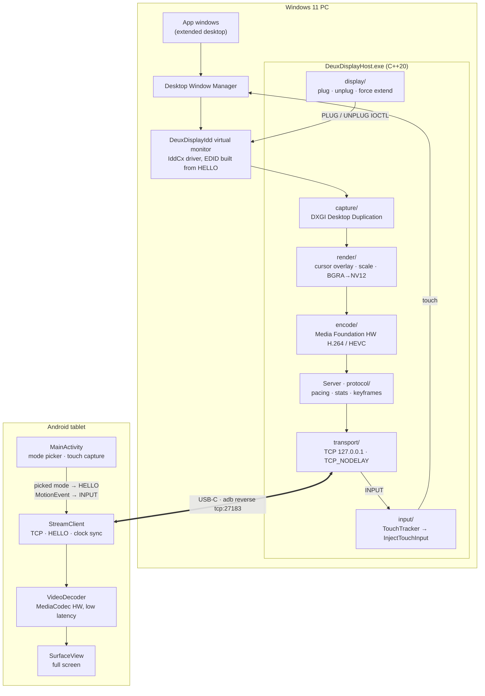
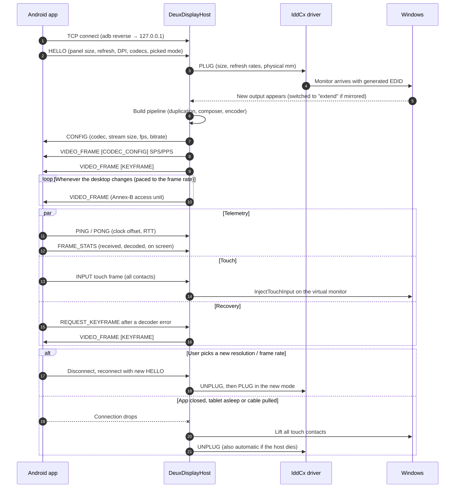
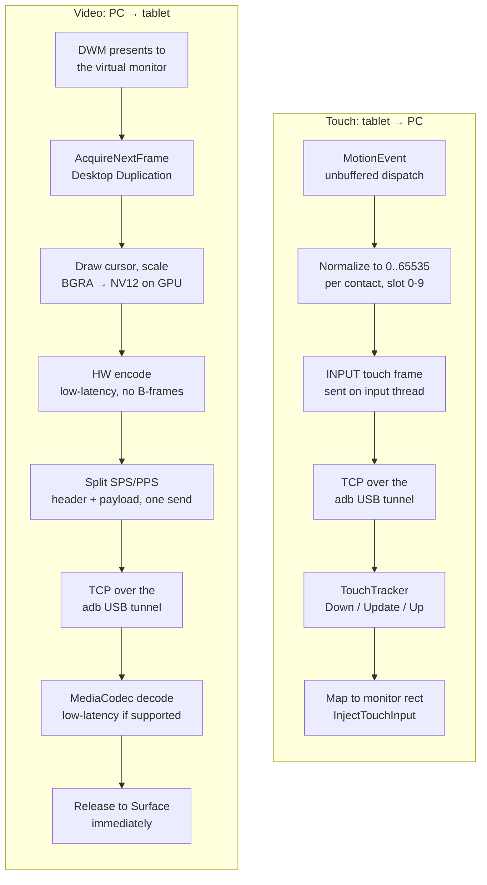
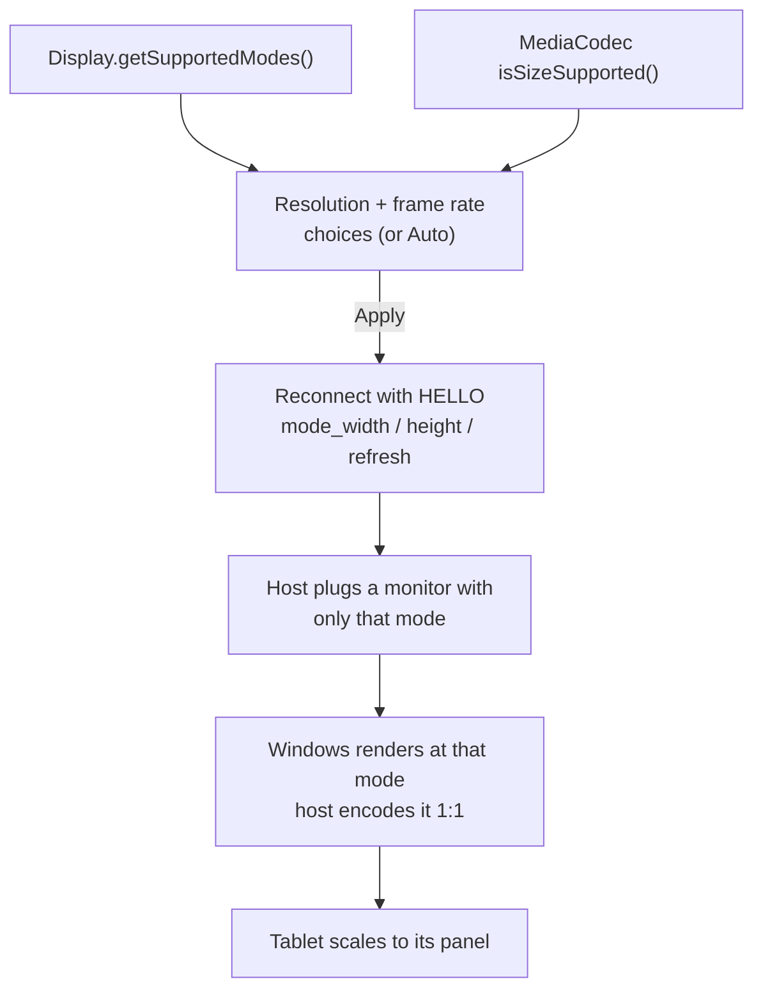

# DeuxDisplay

Use an Android tablet as a **low-latency extended monitor** for Windows 11, over a USB-C cable.

DeuxDisplay adds a real virtual monitor to Windows through an Indirect Display Driver. It captures
that monitor with Desktop Duplication, hardware-encodes it to H.264 in low-latency mode, and
streams it over an ADB USB tunnel to an Android app that decodes straight to the screen.

> **Status: early development, working end to end on the reference device.** See
> [PLAN.md](PLAN.md) for milestones. Not yet packaged for end users.

Reference hardware: OnePlus Pad Go (2408×1720 @ 90 Hz). Other Windows 11 PCs and Android 8+
devices are meant to work too.

## How it works

A virtual monitor on the PC is captured, hardware-encoded and streamed over USB to the tablet,
which decodes it straight to the screen. Touches on the tablet travel the same tunnel back and
are injected on that monitor.

---

### Architecture



| Part | Where | Job |
|------|-------|-----|
| Virtual display driver | `driver/` | Adds a real monitor to Windows, sized to the tablet (MS-PL) |
| Host | `host/` | Plugs the monitor, captures, encodes, streams, injects touch |
| Android client | `android/` | Connects, decodes to the screen, sends touch and the picked mode |
| Wire protocol | `docs/wire-protocol.md` | Source of truth for every message both sides exchange |

---

### A session, end to end



---

### Frame and touch paths

Every stage below is on the latency budget: no queues, no frame pacing on the client, one
`send()` per message. Numbers live in [docs/latency-notes.md](docs/latency-notes.md).



---

### Picking the stream format

The app lists only modes the device can show: the panel's own sizes and refresh rates, plus
scaled-down sizes the hardware decoder accepts. Press **Back** while streaming to open the picker.



More detail in [docs/architecture.md](docs/architecture.md) and the protocol spec in
[docs/wire-protocol.md](docs/wire-protocol.md).

## Repository layout

| Path                 | What                                                            |
|----------------------|-----------------------------------------------------------------|
| `driver/`            | IddCx virtual display driver (C++, UMDF)                        |
| `host/`              | Windows capture/encode/stream service (C++20)                   |
| `android/`           | Android client app (Kotlin)                                     |
| `docs/`              | Architecture, wire protocol, latency notes                      |
| `scripts/`           | Dev bootstrap, driver test-signing/install, run helpers         |
| `.github/workflows/` | CI                                                              |

## Building from source

### Prerequisites
- Windows 11 x64
- Visual Studio 2022 or Build Tools 2022 with **Desktop development with C++**
  (MSVC v143, Windows 11 SDK). The WDK is pulled from NuGet automatically for the driver build.
- An Android device with **USB debugging** enabled

The Java/Android toolchain installs per-user with one script (no admin rights needed):

```powershell
.\scripts\bootstrap-dev.ps1            # add -PersistEnv to set JAVA_HOME/ANDROID_HOME/PATH for new shells
```

### Host
From a *Developer PowerShell for VS 2022*:
```powershell
msbuild DeuxDisplay.sln /p:Configuration=Release /p:Platform=x64 /m
.\host\x64\Release\DeuxDisplayHost.exe --list-outputs
```

### Driver
Also needs the VS **Windows Driver Kit** component (VS 17.14+). See
[driver/README.md](driver/README.md).
```powershell
msbuild driver\DeuxDisplayIdd.sln /t:restore /p:RestorePackagesConfig=true
msbuild driver\DeuxDisplayIdd.sln /p:Configuration=Release /p:Platform=x64
.\scripts\install-driver.ps1                               # elevated, once; no test-signing mode needed
.\host\x64\Release\DeuxDisplayHost.exe --create-display    # normal user: virtual monitor appears
```
`install-driver.ps1` trusts a locally generated signing certificate on your machine. Read
[driver/README.md](driver/README.md) first. After installation nothing needs admin rights.

### Try the stream without a tablet
```powershell
.\host\x64\Release\DeuxDisplayHost.exe --serve             # waits on 127.0.0.1:27183
python tools\dump_receiver.py --seconds 10                 # acts as the tablet; writes out.h264
ffplay out.h264
```

### Android app
```powershell
cd android
.\gradlew.bat assembleDebug
```

### Run it
With the tablet connected over USB (USB debugging on) and the driver installed:
```powershell
.\scripts\run.ps1 -Install    # adb reverse + install/launch the app + run the host; Ctrl+C to stop
```
The tablet shows up as a monitor to the right of your main display. Closing the app or unplugging
the cable removes it again.

On the tablet:
- **Touch** controls the PC: tap, drag, and multi-finger gestures are injected on the tablet's
  monitor (`--no-touch` on the host turns this off).
- **Back** opens the stream settings: resolution and frame rate from what the device supports,
  or *Auto*. Applying reconnects, and the monitor comes back in the new mode.

## Contributing
See [CONTRIBUTING.md](CONTRIBUTING.md).

## License
[MIT](LICENSE), except `driver/`, which is derived from Microsoft's IddCx sample and is
licensed under [MS-PL](driver/LICENSE). See
[driver/THIRD_PARTY_NOTICES.md](driver/THIRD_PARTY_NOTICES.md).
