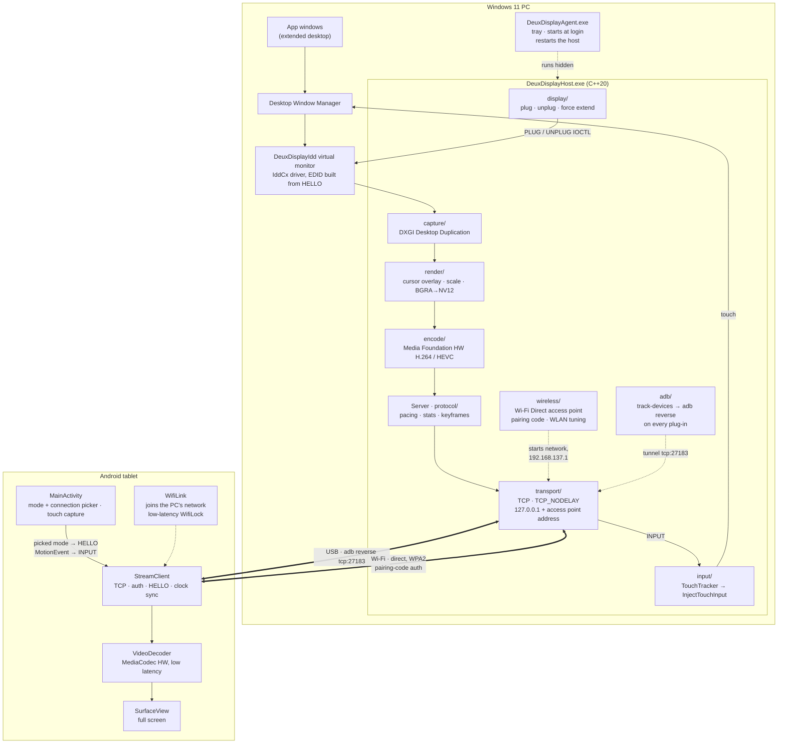
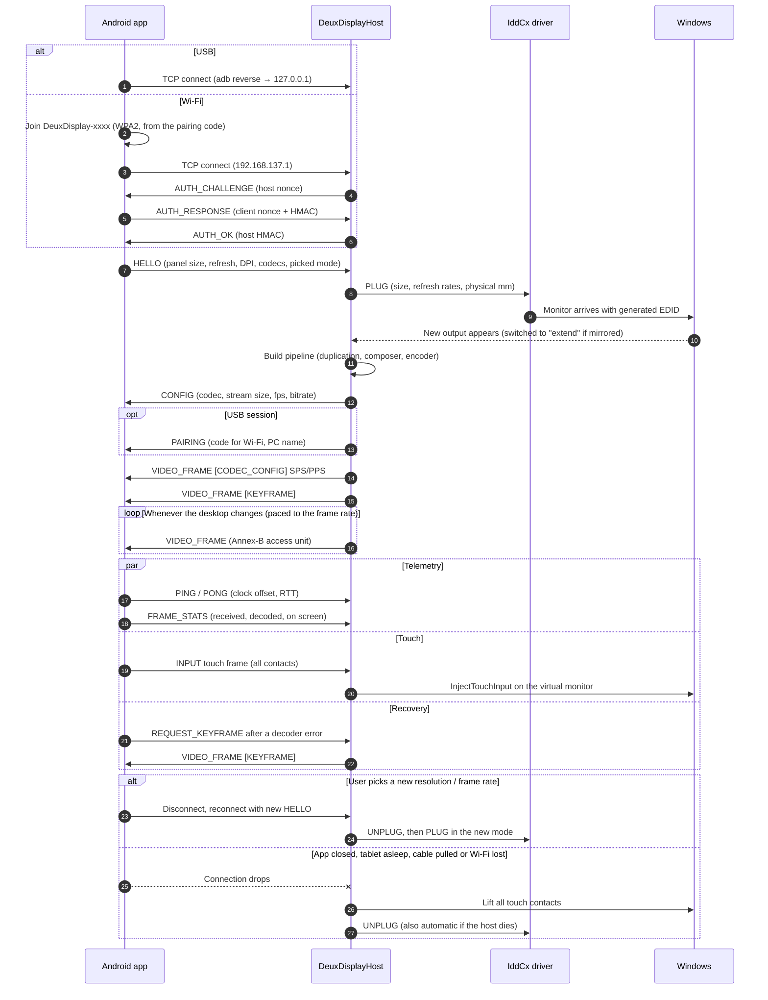
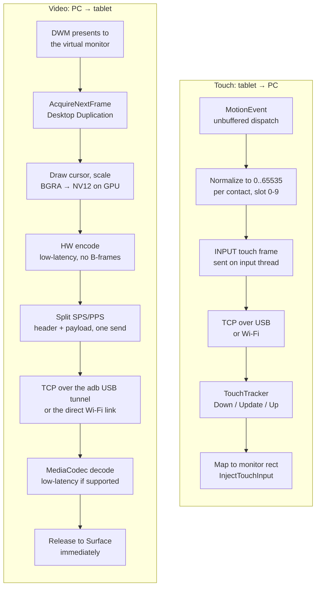
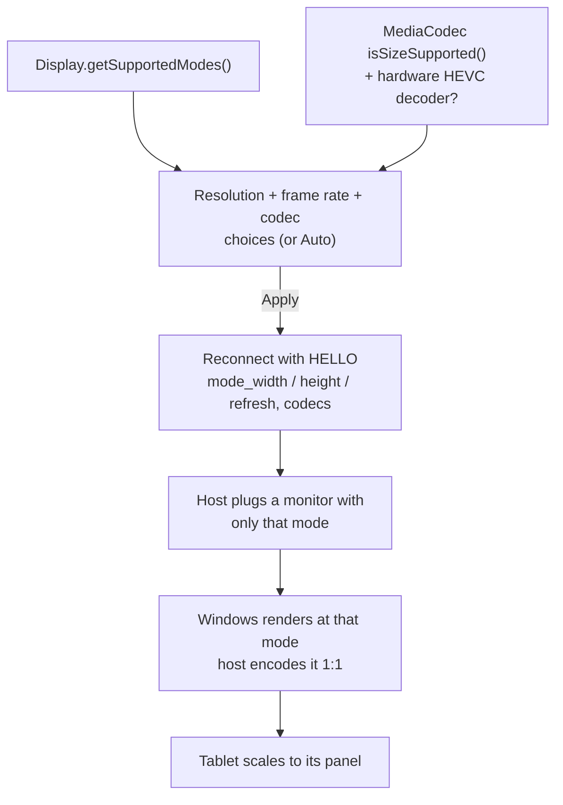
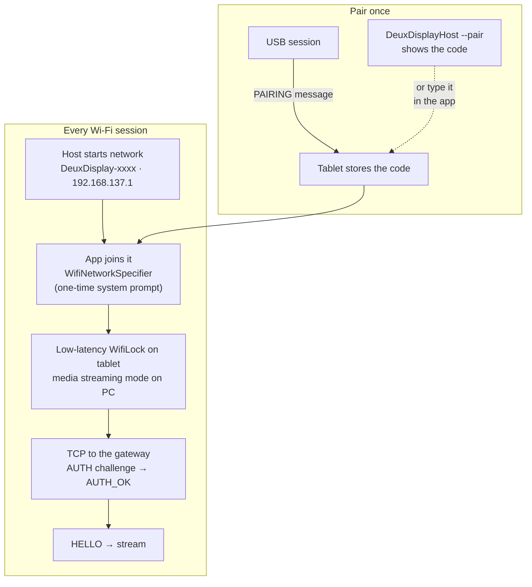

# DeuxDisplay

Use an Android tablet as a **low-latency extended monitor** for Windows 11, over a USB-C cable
or wirelessly over a direct Wi-Fi link to the PC.

DeuxDisplay adds a real virtual monitor to Windows through an Indirect Display Driver. It captures
that monitor with Desktop Duplication, hardware-encodes it to H.264/HEVC in low-latency mode, and
streams it to an Android app that decodes straight to the screen. The stream travels over an ADB
USB tunnel, or over a private Wi-Fi network the PC creates itself (no router in between).

> **Status: early development, working end to end on the reference device.** See
> [PLAN.md](PLAN.md) for milestones. Not yet packaged for end users.

Reference hardware: OnePlus Pad Go (2408×1720 @ 90 Hz). Other Windows 11 PCs and Android 8+
devices are meant to work too.

## How it works

A virtual monitor on the PC is captured, hardware-encoded and streamed to the tablet, which
decodes it straight to the screen. Touches on the tablet travel the same connection back and are
injected on that monitor. The host serves **USB** and **Wi-Fi** at the same time, and the app
picks which one to use.

---

### Architecture



| Part | Where | Job |
|------|-------|-----|
| Virtual display driver | `driver/` | Adds a real monitor to Windows, sized to the tablet (MS-PL) |
| Host | `host/` | Plugs the monitor, captures, encodes, streams, injects touch, keeps the USB tunnel up |
| Agent | `host/agent/` | Tray app that runs the host in the background from login |
| Android client | `android/` | Connects, decodes to the screen, sends touch and the picked mode |
| Wire protocol | `docs/wire-protocol.md` | Source of truth for every message both sides exchange |
| Wi-Fi link | `host/src/wireless/`, `android/.../WifiLink.kt` | The PC's own network, pairing, radio tuning |

---

### A session, end to end



---

### Frame and touch paths

Every stage below is on the latency budget: no queues, no frame pacing on the client, one
`send()` per message. Numbers live in [docs/latency-notes.md](docs/latency-notes.md).



---

### Picking the stream format

The app lists only modes the device can show: the panel's own sizes and refresh rates, plus
scaled-down sizes the hardware decoder accepts, and a 30 fps stream-only rate. Press **Back**
while streaming to open the picker. Choices made there override the host's `--max-stream-size`,
`--max-fps` and `--codec` options.

**Codec** is *Auto*, *H.264* or *HEVC (H.265)* (HEVC is listed only if the tablet has a hardware
HEVC decoder). The pick travels in HELLO's `codecs` bitmask: the app advertises only the chosen
codec. *Auto* offers HEVC only at sizes the HEVC decoder is rated for, and the host then prefers
it; an explicit HEVC pick is used at any size. HEVC gives sharper text per bit and more decoder
headroom, but on the reference tablet it doesn't lower latency (see
[docs/latency-notes.md](docs/latency-notes.md)).



---

### Connecting over Wi-Fi

The PC runs its own Wi-Fi network (a Wi-Fi Direct group in "legacy" mode, which the tablet joins
like any WPA2 access point). Each frame crosses the air once, with no router and no other traffic
on the link. One **pairing code** (20 characters) derives the network name, its WPA2 passphrase
and the key for a mutual challenge-response, so only paired tablets can join or connect.



- The host listens only on 127.0.0.1 (USB) and on its own network's address, never on your LAN.
- While streaming over Wi-Fi the tablet leaves its usual Wi-Fi (most tablets can't join two
  networks), so it has no internet until the app closes.
- **Latency status:** the direct link is ~2x faster at the median and 3–7x higher in throughput
  than going through a router. But the Windows/Intel AX211 access point is away for ~60 ms of
  every ~100 ms beacon period, so frames currently land 55–60 ms after capture (vs ~23 ms over USB).
  Details and next steps are in [docs/latency-notes.md](docs/latency-notes.md#wi-fi). USB is
  still the lowest-latency option.

More detail in [docs/architecture.md](docs/architecture.md) and the protocol spec in
[docs/wire-protocol.md](docs/wire-protocol.md).

## Repository layout

| Path                 | What                                                            |
|----------------------|-----------------------------------------------------------------|
| `driver/`            | IddCx virtual display driver (C++, UMDF)                        |
| `host/`              | Windows capture/encode/stream service (C++20)                   |
| `android/`           | Android client app (Kotlin)                                     |
| `docs/`              | Architecture, wire protocol, latency notes                      |
| `scripts/`           | Dev bootstrap, driver install, Wi-Fi firewall rule, run helpers |
| `.github/workflows/` | CI                                                              |

## Building from source

### Prerequisites
- Windows 11 x64
- Visual Studio 2022 or Build Tools 2022 with **Desktop development with C++**
  (MSVC v143, Windows 11 SDK). The WDK is pulled from NuGet automatically for the driver build.
- An Android device with **USB debugging** enabled

The Java/Android toolchain installs per-user with one script (no admin rights needed):

```powershell
.\scripts\bootstrap-dev.ps1            # add -PersistEnv to set JAVA_HOME/ANDROID_HOME/PATH for new shells
```

### Host
From a *Developer PowerShell for VS 2022*:
```powershell
msbuild DeuxDisplay.sln /p:Configuration=Release /p:Platform=x64 /m
.\host\x64\Release\DeuxDisplayHost.exe --list-outputs
```

### Driver
Also needs the VS **Windows Driver Kit** component (VS 17.14+). See
[driver/README.md](driver/README.md).
```powershell
msbuild driver\DeuxDisplayIdd.sln /t:restore /p:RestorePackagesConfig=true
msbuild driver\DeuxDisplayIdd.sln /p:Configuration=Release /p:Platform=x64
.\scripts\install-driver.ps1                               # elevated, once; no test-signing mode needed
.\host\x64\Release\DeuxDisplayHost.exe --create-display    # normal user: virtual monitor appears
```
`install-driver.ps1` trusts a locally generated signing certificate on your machine. Read
[driver/README.md](driver/README.md) first. After installation nothing needs admin rights.

### Try the stream without a tablet
```powershell
.\host\x64\Release\DeuxDisplayHost.exe --serve             # USB (127.0.0.1:27183) + Wi-Fi
.\host\x64\Release\DeuxDisplayHost.exe --pair              # Wi-Fi pairing code
python tools\dump_receiver.py --seconds 10                 # acts as the tablet; writes out.h264
ffplay out.h264
```

### Android app
```powershell
cd android
.\gradlew.bat assembleDebug
```

### Run it: plug and play (USB)
Once, with the driver installed and the app on the tablet (`.\scripts\run.ps1 -Install` installs it):
```powershell
.\scripts\install-autostart.ps1    # per user, no admin; -Remove undoes it
```
This starts **DeuxDisplayAgent** now and at every login: a tray icon that keeps the host running
in the background (log: `%LOCALAPPDATA%\DeuxDisplay\host.log`). From then on it behaves like a
monitor cable:

1. Open DeuxDisplay on the tablet.
2. Plug in the USB cable. The tablet appears as a monitor to the right of your main display
   within about a second.
3. Unplug it, close the app or let the tablet sleep, and the monitor goes away.

Plugging in with the app closed does nothing: the tablet just charges.

- **USB debugging must be on** (Settings > About tablet > tap *Build number* 7 times, then
  Developer options > USB debugging). The stream travels over adb. The first time, accept
  *Allow USB debugging* on the tablet and tick *Always allow from this computer*.
- **Any USB mode works:** *Charging only* (Android's default), *File transfer* and so on. adb runs
  alongside all of them. Switching modes briefly drops the display, and it comes back by itself.
- The host re-creates the adb tunnel whenever the tablet (re)appears: cable re-plugged, USB mode
  switched, or the adb server restarted by another tool. No need to run `adb reverse` yourself.

To try options or watch the log live, exit the agent from the tray and use the console runner
instead: `.\scripts\run.ps1` (`-Codec hevc`, `-MaxFps 60`, ...). Options can also be set for
the agent: `.\scripts\install-autostart.ps1 -HostArgs '--codec hevc'`.

**Wireless** (not started in the background): after one USB session, which pairs the tablet,
exit the agent from the tray. Then press **Back** on the tablet, set **Connection** to *Wi-Fi
(direct to PC)* and **Apply**. Approve Android's "connect to DeuxDisplay-xxxx" prompt the first
time. From then on the cable is optional:
```powershell
.\scripts\run.ps1 -Transport Wifi    # or Both (default) / Usb
```
Windows Firewall has to allow the host inbound. `install-driver.ps1` sets that up
(`scripts\enable-wireless.ps1`), otherwise Windows asks the first time. The Wi-Fi option needs
Android 10+ and a PC Wi-Fi adapter with Wi-Fi Direct.

On the tablet:
- **Touch** controls the PC: tap, drag, and multi-finger gestures are injected on the tablet's
  monitor (`--no-touch` on the host turns this off).
- **Back** opens the settings: resolution and frame rate from what the device supports (or
  *Auto*), the codec (*Auto*, H.264 or HEVC), the connection (USB or Wi-Fi), and a field for
  typing a pairing code. Applying reconnects, and the monitor comes back in the new mode. The
  choices are remembered.
- For the lowest latency on the reference tablet, stay at **60 fps** or below: its decoder
  manages ~60 fps at native size, and extra frames queue up.

## Contributing
See [CONTRIBUTING.md](CONTRIBUTING.md).

## License
[MIT](LICENSE), except `driver/`, which is derived from Microsoft's IddCx sample and is
licensed under [MS-PL](driver/LICENSE). See
[driver/THIRD_PARTY_NOTICES.md](driver/THIRD_PARTY_NOTICES.md).
